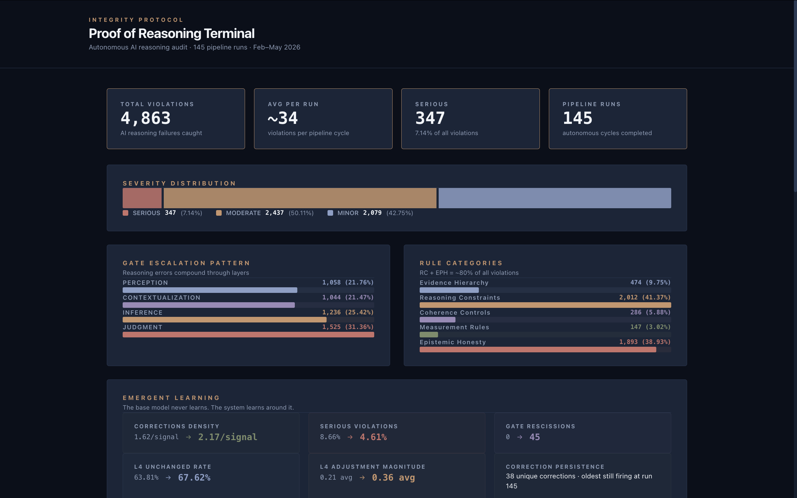
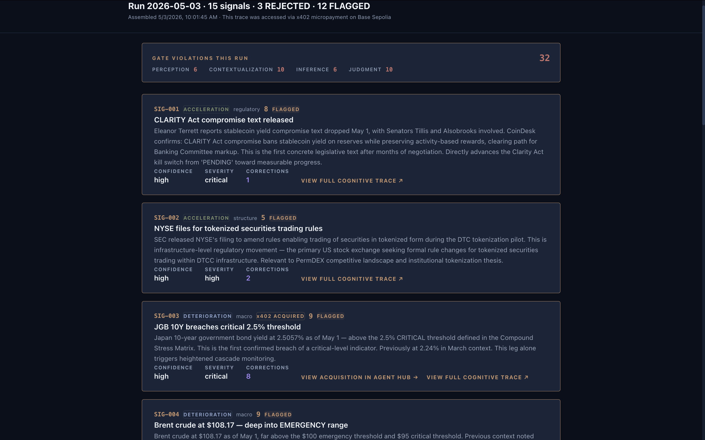
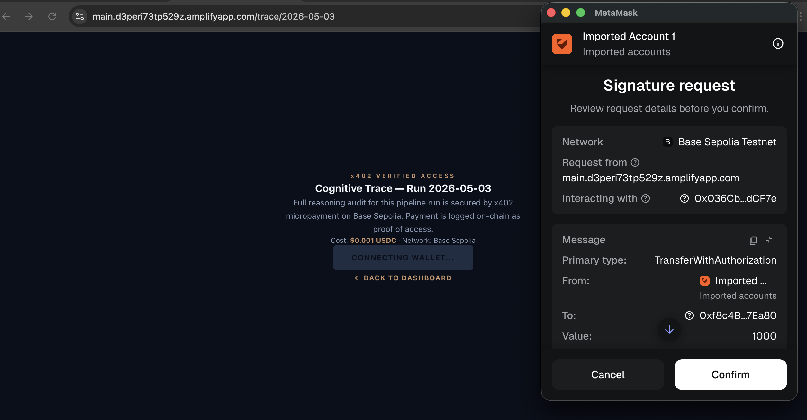

# Proof of Reasoning Terminal

**AI agents make confident decisions with zero accountability. The Integrity Protocol forces AI to show its reasoning, admit what it doesn't know, and catch its own hallucinations before they become decisions.**

🔗 **Live Demo:** [main.d3peri73tp529z.amplifyapp.com](https://main.d3peri73tp529z.amplifyapp.com)

🎥 **Demo Video:** [Watch the full walkthrough](https://www.loom.com/share/6a8db8f341c849b08cb816cf2c97fb8b)

📂 **Pre-existing infrastructure:** [github.com/Integrity-Protocol](https://github.com/Integrity-Protocol)

---

## What It Does

The Proof of Reasoning terminal visualizes **4,863 AI reasoning failures** caught autonomously by the Integrity Protocol across **145 pipeline runs** over 3 months of continuous production operation.

- **Billboard** — headline metrics, severity distribution, gate escalation patterns, top violated rules, and emergent learning indicators. Free and public.
- **Run Ledger** — scrollable index of every autonomous pipeline run with per-run violation summaries. Free to browse.
- **x402-Gated Cognitive Trace** — click any run, pay a $0.001 USDC micropayment on Base Sepolia, and the full reasoning audit loads. Every trace access is logged on-chain — which trace was opened and when.

The transaction isn't a paywall. It's an audit log.

---

## Blockchain Interaction

**Network:** Base Sepolia (Coinbase L2 testnet)

**Protocol:** [x402](https://www.x402.org/) — HTTP 402 payment protocol by Coinbase

**How it works:**

1. User clicks a pipeline run in the ledger
2. The trace API route returns HTTP 402 with payment requirements
3. The client-side x402 library prompts MetaMask for a USDC signature on Base Sepolia
4. Payment is verified by the x402 facilitator
5. The signed request is replayed — the API releases the cognitive trace data
6. The transaction is permanent and verifiable on [Base Sepolia explorer](https://sepolia.basescan.org)

**Merchant wallet:** `0xf8c4Be305969A821A581D8098D97E3E8a457Ea80`

**Facilitator:** `https://x402.org/facilitator`

**Why x402:** Every trace access creates an on-chain receipt. In production, this is how authorized parties verify that AI reasoning was structurally audited before the system acted. The economic cost prevents bulk scraping. The on-chain log provides tamper-proof access history.

---

## What's Behind the Data

The Integrity Protocol is a four-layer cognitive architecture:

**SWEEP** → **CONTEXTUALIZE** → **INFER** → **RECONCILE**

Every layer transition is gated by **17 epistemological rules** (Layer Zero) — evidence hierarchy, reasoning constraints, coherence controls, measurement rules, and epistemic honesty requirements. When any layer's output violates a rule, the gate catches it before the reasoning advances.

The 17 rules are domain-agnostic. They apply unchanged to finance, healthcare, defense, or any domain where a wrong AI decision has consequences.

The system has been running autonomously twice daily since February 2026. It processes live market signals, applies the four-layer pipeline, and logs every reasoning step in a cognitive trace. The gate violations visible in this terminal are the exhaust of that process.

**Key finding:** The base model never learns. The system learns around it.
- Corrections density up 34%
- SERIOUS violations down 47%
- Gate rescissions emerged organically (0 → 45)
- 131 corrections ledger entries accumulated through production operation

---

## Built During the Hackathon (May 5–7, 2026)

- Proof of Reasoning terminal (React/Next.js)
- Billboard visualization with severity, gate escalation, rule breakdown, emergent learning
- Run ledger with per-run summaries from 145 cognitive traces
- x402-gated trace access on Base Sepolia via Coinbase CDP
- Next.js API routes deployed as Lambda on AWS Amplify
- Client-side x402 payment flow (viem + @x402/fetch + MetaMask)
- This README, presentation deck, and demo video

---

## Pre-Existing Code (Disclosed)

Per hackathon Rule 2, the following pre-existing infrastructure is disclosed:

- The Integrity Protocol four-layer pipeline and 17 Layer Zero rules
- Corrections Ledger (131 entries) and Behavioral Calibration system
- x402 Economic Airlock with enforcement gates
- Agent Hub UI (separate repo, separate Amplify deployment)
- Overwatch Dashboard (5 pages on GitHub Pages)
- 145 cognitive trace files and gate-violation-summary.json
- Three provisional patent applications filed with the USPTO

Disclosure letter delivered to organizers on Day 1. Full commit history is publicly available. The pre-existing system generates the data. The hackathon build provides the interface, the access control, and the on-chain audit trail.

---

## Infrastructure

| Component | Service |
|---|---|
| Frontend + API | Next.js 16 on AWS Amplify (SSR + Lambda) |
| Payments | x402 on Base Sepolia (Coinbase CDP) |
| Wallet | MetaMask (browser) |
| Data | 145 cognitive trace JSON files + gate-violation-summary.json |
| Pipeline | GitHub Actions (twice daily, autonomous) |

---

## Screenshots

### Billboard — 4,863 reasoning failures across 145 autonomous pipeline runs

### Signal Trace — x402 ACQUIRED badges on signals where the agent purchased data autonomously

### x402 Payment Gate — cryptographic notarization on Base Sepolia via MetaMask

---

## Team

**Tim Wrenn** — Founder & Architect, Integrity AI LLC

Fire lieutenant. 18 years. Structural collapse instructor. Zero coding background. Built The Integrity Protocol by directing AI tools with natural language. Three provisional patents filed pro se.

tim@integrityai.ai

---

## License

Open source per hackathon requirements. Patent pending — Integrity AI LLC.
